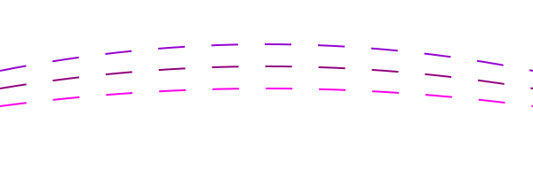

    

<h1 align="center">Neo Simmerling</h1>

    Hi! I'm Neo!

## Tech Stack

<h3>Frontend</h3>

    
    
    

<h3>Backend</h3>

    
    
    

<h3>Dev-Tools</h3>

    

###

## Snake :D

    

